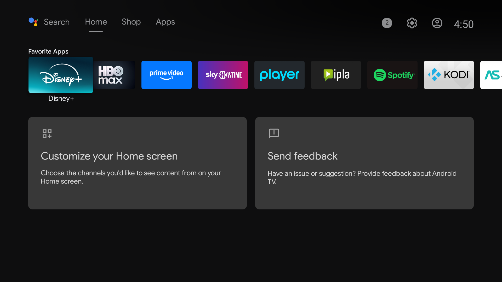
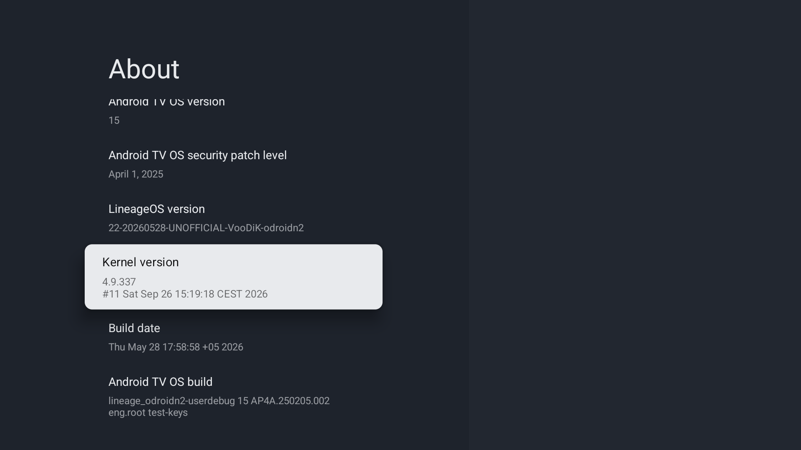
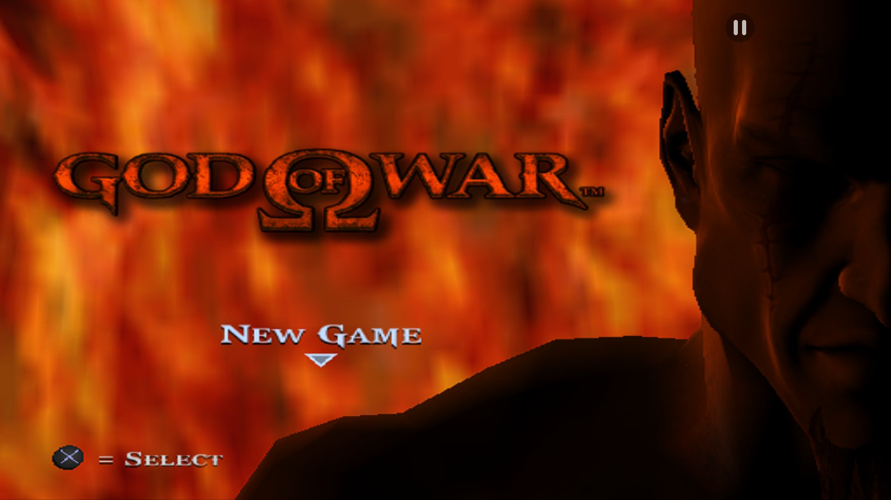
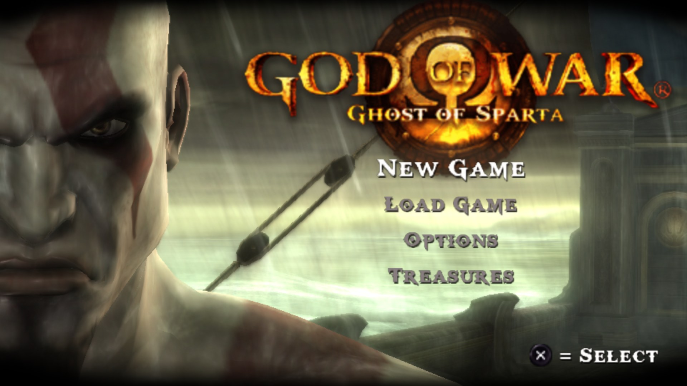
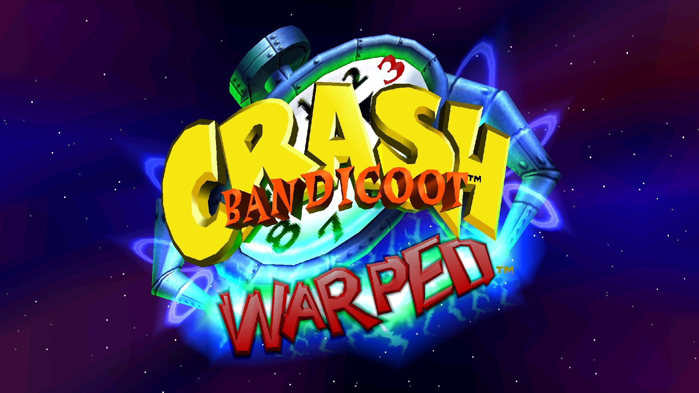

# Android 15 TV dla Beelink GT-King — `galilei`

[English](README.md) · **Polski** · [简体中文](README.zh-CN.md)

Beelink GT-King (Amlogic **S922X**, 4×Cortex-A73 @2,2 GHz + 2×A53, Mali-G52, 4 GB LPDDR4,
64 GB eMMC, Wi-Fi 5/BT 5 AP6275S) nigdy nie dostał nic nowszego niż Android 9 — ani od Beelinka,
ani w ROM-ach społeczności opartych na fabrycznym firmware. To repozytorium to kompletne
uruchomienie **Androida 15 w wersji Android TV** na tym boxie: drzewo urządzenia, poprawki kernela,
łańcuch bootloadera, paczki do wgrania, narzędzia użyte po drodze i notatki z każdej ślepej uliczki.

Dwie wersje, ten sam łańcuch bootloadera, ta sama procedura wgrywania:

| | **v1** — LineageOS 22.2 | **v3** — 64-bit |
|---|---|---|
| Przestrzeń użytkownika | 32-bit (armeabi-v7a), jak fabryczny firmware | **arm64 + arm** |
| Baza | LineageOS 22.2 zbudowany ze źródeł z tym drzewem urządzenia | LineageOS 22.1 ATV od voodika dla ODROID-N2 (ten sam S922X) + kernel, DTB i poprawki vendor dla GT-Kinga |
| Sterownik GPU | Mali r32p1 (32-bit) | Mali r51p0, Vulkan 1.3, GLES 3.2 |
| Aplikacje Google | tak (MindTheGapps dla Android TV) | tak |
| Dla kogo | prosty, lekki Android TV | emulacja (PS2, GameCube/Wii wymagają 64 bitów) |

> **v3** (2026-10-09) to aktualna wersja 64-bit — v2 z poprawką dźwięku HDMI / S-PDIF / jack.
> v2 (na tych wyjściach cisza, działał tylko dźwięk przez Bluetooth) jest wycofana i nie jest już udostępniana.

Pobieranie: [GitHub Releases](https://github.com/MKmajster/gt-king-android-tv/releases/latest) ·
instalacja: [`docs/release/INSTALL.md`](docs/release/INSTALL.md) (po angielsku) ·
lista zmian i sumy kontrolne: [`docs/release/RELEASE-NOTES.md`](docs/release/RELEASE-NOTES.md) ·
dyskusja i pomoc: [wątek na XDA](https://xdaforums.com/t/rom-android-15-unofficial-s922x-lineageos-22-2-64-bit-android-tv-for-beelink-gt-king-galilei.4802970/)

## Zrzuty ekranu

| | |
|---|---|
|  |  |
|  |  |
|  | zrzuty z v3 (64-bit), wykonane na boxie przez ADB (1920×1080) |

## Co działa

| | |
|---|---|
| System | Interfejs Android 15 TV, kernel 4.9.337 (arm64), userdebug; ADB przez sieć |
| Wideo | Sprzętowe dekodowanie H.264 / HEVC / VP9 — YouTube i SmartTube odtwarzają 4K60 VP9 bez gubienia klatek; tryby wyjścia 4K są dostępne (nie testowane na telewizorze 4K) |
| Dźwięk | HDMI / S-PDIF / analogowy (jack 3,5 mm) L-PCM przez kartę dźwiękową Amlogic „auge” (v1: zestaw DAI poprawiony w DTS; v3: naprawiony mux TOHDMITX przez `i2s2hdmi` — na v2 te wyjścia milczały) |
| Wi-Fi / BT | AP6275S (BCM43752) 5 GHz 11ac; Bluetooth 5 (v2: przez zwykły HCI UART z poprawką kernela) |
| Pilot | Fabryczny pilot na podczerwień z tabelą klawiszy Beelinka; piloty USB/BT, klawiatury, pady (v2: podłączanie w locie działa też po uśpieniu) |
| Zasilanie | Kontrola temperatury na obu klastrach CPU (fabryczny DTS nigdy nie dławił rdzeni A53), uśpienie z wyłączonym sygnałem HDMI i natychmiastowe wybudzenie (SoC pozostaje aktywny) |
| Pamięć | eMMC, microSD, USB host (2.0 + 3.0 za hubem Fresco Logic) |
| Inne | RTC (HYM8563), sterownik/HAL HDMI-CEC (sterowanie telewizorem jeszcze nie testowane), Widevine L3 + ClearKey |

Znane ograniczenia (szczegóły w [`docs/release/INSTALL.md`](docs/release/INSTALL.md)): tylko Widevine
L3 (ten box nie ma klucza L1, także na fabrycznym firmware), aplikacja Netflix na Android TV
odrzuca niecertyfikowane urządzenia, wbudowany odbiornik Chromecast nie może się zarejestrować
(wymaga certyfikatu przypisanego do urządzenia), uśpienie bez głębokiego snu, ADB przez USB nie
działa (używaj ADB przez sieć), Ethernet nie testowany (PHY w testowym egzemplarzu jest uszkodzony
sprzętowo).

## Emulacja na v3 (64-bit, zmierzone, telewizor 1080p60)

| System | Emulator | Wynik |
|---|---|---|
| PlayStation 2 | ARMSX2 (Vulkan, natywna rozdzielczość, łatki 16:9 i bez przeplotu, AF 8x, wyostrzanie) | God of War (PAL) 50/50 fps; Crash Bandicoot: The Wrath of Cortex 38–50 fps w grze z przyspieszaczami dla tej gry (EE cycle rate/skip, konwersja palet na GPU) — najcięższa testowana gra |
| PSP | PPSSPP (osobna aplikacja, Vulkan, 2x) | God of War: Ghost of Sparta 60/60 fps |
| PlayStation | RetroArch SwanStation (5x = 1080p, PGXP, kolor 24-bit, 16:9) | 50/50 fps |
| SNES / NES | RetroArch Snes9x / FCEUmm z shaderem CRT i run-ahead | pełna prędkość |

PS2 w pełnej prędkości wymaga zablokowania zegara Mali na 800 MHz (v3 robi to przy starcie: sterownik
bifrost zawsze raportuje obciążenie 0, więc governor zostawał na 399 MHz). Skalowanie rozdzielczości
PS2 przerasta Mali-G52 (1,5x/2x = 20–34 fps). Nic z tego nie jest możliwe na v1: emulator PS2
rezerwuje ~8 GB przestrzeni adresowej, a Dolphin istnieje tylko w wersji arm64.

## Wgrywanie

Zobacz [`docs/release/INSTALL.md`](docs/release/INSTALL.md). W skrócie: Amlogic USB Burning Tool
2.2.0, rozpakowany plik `.img`, `adb reboot update` z kablem USB-A↔A w porcie OTG, 5–8 minut
czekania, odłączenie zasilania. Paczka `aml_upgrade_package_stock-restore+stockbl` przywraca
fabryczny firmware Beelinka.

## Jak to startuje (i dlaczego nietypowo)

GT-King ma zablokowany u-boot Amlogic z 2015 roku, którego BL2 zawiera trening pamięci LPDDR4 tej
płyty. Zamiast go wymieniać, paczki zostawiają **fabryczny bootloader** i dokładają drugi stopień:

1. fabryczny BL2 → BL31/BL32 → fabryczny u-boot (`g12b_w400`),
2. jego hak `preboot`: `if store read bl33 …; then go 0x1000000` — wczytuje **nasz** u-boot
   LineageOS (BL33 v4, `lineage/uboot/gen_galilei_board.py`) z osobnej partycji `bl33` i skacze
   do niego,
3. nasz u-boot uruchamia `boot` z DTB GT-Kinga.

Oba u-booty czytają ten sam `_aml_dtb`, więc jest to **kontener multi-DTB** Amlogic z dwoma
wpisami: fabrycznym DTB `g12b_w400_b` (z przeszczepioną nową tabelą partycji — z każdym innym
fabryczny u-boot zawiesza się na inicjalizacji Ethernetu) i naszym `g12b_s922x_galilei`.
Hak siedzi we **wkompilowanym domyślnym środowisku** fabrycznego u-boota: BL33 z fabrycznego FIP
jest rozpakowywany (LZ4), jego 147-bajtowy ciąg `preboot=` podmieniany, a obraz ponownie podpisywany
narzędziem Amlogic `aml_encrypt_g12b` (`lineage/scripts/patch-stock-bl33-env.py`); BL2/BL30/BL31/BL32
zostają bajt w bajt identyczne. Dzięki temu paczka działa od razu po wgraniu: USB Burning Tool
kończy każde wgrywanie zapisem (`saveenv`) domyślnego środowiska, więc hak zapisany tylko w
środowisku znika przed pierwszym startem (fabryczny u-boot uruchamia wtedy kernel sam, a ten
zatrzymuje się po 1,8 s bez ustawionego zegara klastra A73).

## Mapa repozytorium

| Ścieżka | Zawartość |
|---|---|
| `lineage/device/beelink/galilei/` | Drzewo urządzenia LineageOS dla v1 (dziedziczy `device/amlogic/g12-common`): konfiguracja płyty, tabele klawiszy pilota, konfiguracja firmware Wi-Fi/BT, pliki init, dołączanie GApps |
| `lineage/device/beelink/galilei/v2/` | Pomocnicze programy vendor v2: `btuart-attach.c` (2 KB, statyczne podpięcie HCI UART dla Bluetootha AP6275S), `btdiag.c` |
| `lineage/kernel/dts/` | `g12b_s922x_galilei.dts` (v1) i `v2/` (DTB v2 + tabela partycji) — wartości z fabrycznego w400 + poprawki: DAI audio, mapa chłodzenia, regulatory CPU, Wi-Fi/BT, Ethernet |
| `lineage/patches/` | Łatki kernela v1 (podwójny PM notifier w stmmac = zawieszenie startu bez PHY; przeładowanie meson_wdt po wybudzeniu); `v2/` = sześć łatek na kernel voodika (tabela partycji eMMC, timeout SCPI, stmmac, meson_wdt, konfiguracja hci_bcm, wykrywanie USB po nieudanym uśpieniu); `wip/` = badanie zawieszania hdmitx po wybudzeniu (nie stosowane) |
| `lineage/uboot/gen_galilei_board.py` | Generuje płytę `g12b_galilei_v1` dla u-boota LineageOS (stałe środowisko startowe, bez Ethernetu, bezpieczne dla chainloadu) |
| `lineage/scripts/` | v1: `setup-tree.sh`, `rebuild-final.sh`, `patch-stock-bl33-env.py`, `gen-privapp-allowlist.py`, `make-gapps-vendor.py`, `make-multi-dtb.py`, `make-packages-with-bootloader.sh`, `postflash-check.sh`; v2: `extract-voodik-vendor.sh`, `v2-kernel-patches.sh`, `v2-build-kernel.sh`, `v2-build-dhd.sh`, `v2-build-dtb.sh`, `v2-make-multidtb.sh`, `v2-make-m1.sh`, `v2-adb-flash.py`; wydanie: `make-release-archives.sh`; konsola szeregowa: `serial-console.py`, `uart-*.py`; pomiary: `sf-fps.sh`, `ps2-bench.sh` |
| `docs/option1/` | Dokumentacja uruchomienia: `BRINGUP.md` (budowanie ze źródeł), `FLASH.md` (paczki, procedura z konsolą), `UART.md` (piny złącza), `EMMC-SHORT.md`, `HDMI-BOOT.md` |
| `docs/release/` | `INSTALL.md`, `RELEASE-NOTES.md`, `XDA-thread.bbcode`, `BEELINK-FORUM.md`, `PUBLISH.md` |
| `tools/` | `hdmiboot/` (klucz HDMI-boot dla BootROM na Arduino), `cp210x/` (sterownik USB-UART) |

Notatki z fazy badań (po polsku): [`docs/RESEARCH-NOTES-PL.md`](docs/RESEARCH-NOTES-PL.md).

## Budowanie

v1 (LineageOS 22.2 ze źródeł):

```
# raz: zsynchronizuj LineageOS 22.2 z drzewami Amlogic g12-common (docs/option1/BRINGUP.md)
TOP=~/android/lineage bash lineage/scripts/setup-tree.sh        # drzewo urządzenia, DTS, płyta u-boot, GApps
TOP=~/android/lineage bash lineage/scripts/rebuild-final.sh      # bacon + multi-DTB + paczka Burning Tool
```

`GAPPS=none` buduje bez aplikacji Google. `setup-tree.sh` nakłada też łatki kernela z
`lineage/patches/` na `kernel/amlogic/linux-4.9` (bezpiecznie przy powtórzeniu).

v2 (64-bit; potrzebny obraz ODROID-N2 ATV 22.1 od voodika i paczka v1 z GApps jako baza partycji
bootloadera):

```
bash lineage/scripts/extract-voodik-vendor.sh <jego OTA zip> vendor system   # -> ~/voodik/*.img
bash lineage/scripts/v2-kernel-patches.sh        # kernel voodika @660a3bebdf92 + lineage/patches/v2
bash lineage/scripts/v2-build-kernel.sh
bash lineage/scripts/v2-build-dhd.sh             # moduł sterownika AP6275S
bash lineage/scripts/v2-build-dtb.sh && bash lineage/scripts/v2-make-multidtb.sh
TAG=final bash lineage/scripts/v2-make-m1.sh     # -> aml_upgrade_package_v2-final.img
```

## Wsparcie

To projekt hobbystyczny, darmowy i otwarty. Jeśli przywrócił Twojego GT-Kinga do życia, możesz
postawić mi kawę na [Ko-fi](https://ko-fi.com/mkmajster) (karta lub PayPal) — całkowicie dobrowolnie.

Równie cenne są raporty z testów: Ethernet, telewizory 4K/HDR i HDMI-CEC wciąż nie są sprawdzone.

Masz inny box z Android TV albo projekt, który potrzebuje podobnej pracy? Chętnie podejmę się nowego
projektu lub wesprę istniejący — załóż tutaj zgłoszenie (issue) albo napisz do mnie prywatnie na XDA.

## Podziękowania

Opiekunowie LineageOS i Amlogic g12-common (drzewo urządzenia v1 dziedziczy ich wspólne drzewo i
kernel); **voodik** — jego LineageOS ATV dla ODROID-N2 i kernel są bazą v2/v3
([GitHub](https://github.com/voodik), [wydania ODROID-N2](https://oph.mdrjr.net/voodik/S922X/ODROID-N2/Android/));
Hardkernel; MindTheGapps; społeczności CoreELEC i Khadas za wiedzę o S922X/G12B; projekty
ARMSX2/PCSX2, PPSSPP, DuckStation/SwanStation i RetroArch; Beelink za fabryczny firmware, na którego
bootloaderze i blobach te wersje wciąż się opierają.

## Licencja

Drzewo urządzenia, skrypty i dokumentacja: Apache-2.0. Łatki kernela: GPL-2.0 (modyfikują kernel
Amlogic 4.9). Zamknięte bloby vendor i aplikacje Google nie są częścią tego repozytorium.
